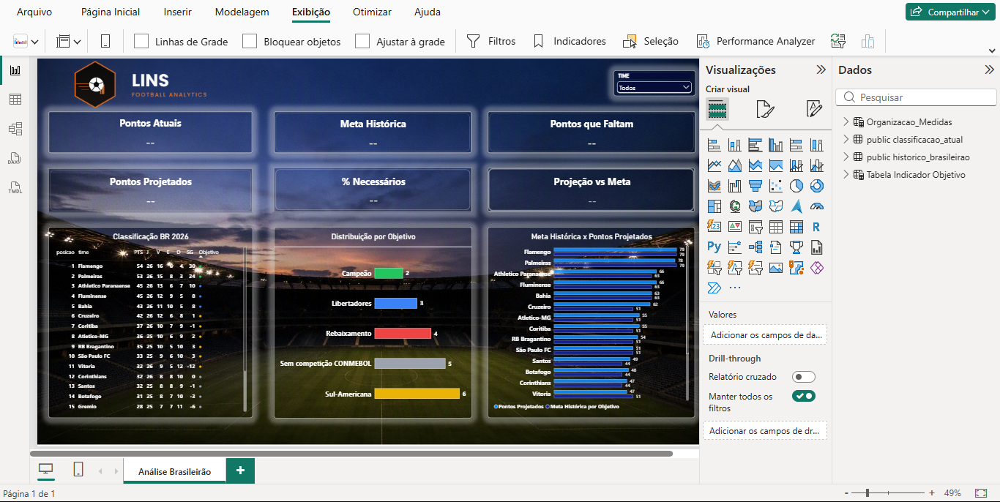

# Brasileirão Analytics 2026

Projeto de análise de dados do Campeonato Brasileiro Série A 2026, desenvolvido como projeto de portfólio para aplicação prática de conceitos de **Python, APIs, PostgreSQL e Power BI**.

O projeto utiliza dados atuais da competição obtidos por meio da API Highlightly, realiza o processamento dos dados com Python, armazena as informações em PostgreSQL e apresenta os principais indicadores por meio de um dashboard desenvolvido no Power BI.

Além da classificação atual, o projeto utiliza dados históricos dos Campeonatos Brasileiros de 2022 a 2025 para criar referências de pontuação para diferentes objetivos da competição.

---

## Sobre o projeto

O **Brasileirão Analytics 2026** foi desenvolvido para acompanhar a evolução da classificação do Campeonato Brasileiro e transformar os dados da competição em informações mais fáceis de analisar.

O projeto combina:

* Classificação atual do Brasileirão 2026;
* Dados históricos das temporadas de 2022 a 2025;
* Médias históricas de pontuação;
* Aproveitamento das equipes;
* Projeção de pontuação até o final da competição;
* Comparação entre pontuação atual, projeção e referências históricas;
* Dashboard interativo no Power BI.

O objetivo é transformar dados esportivos em um projeto prático de análise de dados, utilizando ferramentas presentes no mercado de tecnologia e dados.

---

## Objetivo

O principal objetivo do projeto é desenvolver uma solução simples de análise de dados capaz de:

1. Obter automaticamente a classificação atual do Brasileirão 2026;
2. Processar e organizar os dados utilizando Python;
3. Armazenar os dados em um banco PostgreSQL;
4. Utilizar dados históricos como referência para análise;
5. Criar indicadores de desempenho;
6. Estimar a pontuação final das equipes com base no aproveitamento atual;
7. Apresentar os resultados em um dashboard no Power BI.

---

## Tecnologias utilizadas

### Python

Utilizado para:

* Consumo da API;
* Extração dos dados;
* Tratamento e organização das informações;
* Atualização da tabela de classificação no PostgreSQL.

Principais bibliotecas utilizadas:

* `requests`
* `psycopg2`
* `python-dotenv`

### API Highlightly

Utilizada como fonte dos dados atuais da classificação do Campeonato Brasileiro 2026.

Endpoint utilizado:

```text
/standings
```

Parâmetros principais:

```text
leagueId = 61205
season = 2026
```

### PostgreSQL

Banco de dados utilizado para armazenar:

* Classificação atual do Brasileirão 2026;
* Dados históricos das temporadas anteriores.

Banco utilizado no projeto:

```text
brasileirao_analytics
```

### Power BI

Utilizado para:

* Modelagem e análise dos dados;
* Criação de medidas DAX;
* Indicadores de desempenho;
* Projeções;
* Comparação com médias históricas;
* Desenvolvimento do dashboard final.

---

## Arquitetura do projeto

O fluxo principal do projeto é:

```text
┌──────────────────────┐
│   Highlightly API    │
└──────────┬───────────┘
           │
           ▼
┌──────────────────────┐
│        Python        │
│ Extração e tratamento│
└──────────┬───────────┘
           │
           ▼
┌──────────────────────┐
│      PostgreSQL      │
│ Armazenamento dos    │
│       dados          │
└──────────┬───────────┘
           │
           ▼
┌──────────────────────┐
│      Power BI        │
│ Análise e Dashboard  │
└──────────────────────┘
```

---

## Fluxo dos dados

### 1. Coleta

Os dados atuais da classificação são obtidos através da API Highlightly.

O script responsável pela atualização da classificação é:

```text
python/buscar_classificacao.py
```

### 2. Processamento

O Python recebe os dados da API e organiza as principais informações de cada equipe:

* Posição;
* Time;
* Pontos;
* Jogos;
* Vitórias;
* Empates;
* Derrotas;
* Gols marcados;
* Gols sofridos.

### 3. Armazenamento

Os dados tratados são armazenados na tabela:

```text
public.classificacao_atual
```

Os dados históricos ficam armazenados na tabela:

```text
public.historico_brasileirao
```

### 4. Análise

O Power BI utiliza essas informações para gerar os indicadores e visualizações do projeto.

---

## Banco de dados

O projeto utiliza o PostgreSQL com o banco:

```text
brasileirao_analytics
```

### Tabela `classificacao_atual`

Armazena os dados atuais do Campeonato Brasileiro 2026.

Principais campos:

```text
id
temporada
posicao
time
pontos
jogos
vitorias
empates
derrotas
gols_pro
gols_contra
saldo_gols
atualizado_em
```

### Tabela `historico_brasileirao`

Armazena os dados históricos utilizados como referência para as análises.

Foram utilizados os Campeonatos Brasileiros de:

```text
2022
2023
2024
2025
```

Os dados históricos são utilizados para calcular referências de pontuação para diferentes objetivos.

---

## Referências históricas

O projeto utiliza médias históricas de pontuação para criar referências de desempenho.

### Campeão

Média histórica:

```text
78,60 pontos
```

### Libertadores

Média histórica:

```text
66,95 pontos
```

### Sul-Americana

Média histórica:

```text
53,97 pontos
```

### Referência para o 16º colocado

Média histórica:

```text
43,80 pontos
```

Essa última referência é utilizada principalmente na análise relacionada ao risco de rebaixamento.

---

## Indicadores

O dashboard apresenta indicadores desenvolvidos principalmente utilizando medidas DAX no Power BI.

Entre eles:

* Aproveitamento;
* Meta histórica por objetivo;
* Pontos necessários para atingir a meta histórica;
* Pontos projetados;
* Percentual de pontos restantes para atingir a meta;
* Ranking por projeção;
* Objetivo dinâmico;
* Indicadores de desempenho por equipe.

---

## Projeção de pontuação

A projeção de pontuação não representa uma previsão estatística ou uma probabilidade real de classificação.

O cálculo utiliza o **aproveitamento atual da equipe** como referência para estimar sua pontuação ao final das 38 rodadas.

De forma simplificada:

```text
Aproveitamento atual
        ↓
Projeção para 38 jogos
        ↓
Pontuação projetada
```

A pontuação projetada é então comparada com as médias históricas utilizadas como referência no projeto.

---

## Classificação dos objetivos

Para facilitar a análise, as posições são agrupadas em objetivos:

| Posição   | Objetivo                |
| --------- | ----------------------- |
| 1º        | Campeão                 |
| 2º a 5º   | Libertadores            |
| 6º a 11º  | Sul-Americana           |
| 12º a 16º | Sem competição CONMEBOL |
| 17º a 20º | Rebaixamento            |

Essas classificações são utilizadas principalmente na camada de análise do Power BI.

---

## Dashboard

O resultado final do projeto é apresentado em um dashboard desenvolvido no Power BI.

O dashboard permite acompanhar:

* Classificação atual;
* Pontuação das equipes;
* Aproveitamento;
* Metas históricas;
* Pontos necessários para alcançar cada referência;
* Pontuação projetada;
* Ranking por projeção;
* Objetivos das equipes;
* Comparação entre desempenho atual e referências históricas.

O arquivo do dashboard está disponível em:

```text
Dashboard/Dashboard_Brasileirao_2026.pbix
```

### Prévia do dashboard



### Exemplo de equipe selecionada


### Demonstração do projeto

O repositório também contém um vídeo demonstrativo do projeto:

```text
🎥 [Assistir demonstração do projeto](https://github.com/WallaceLins/brasileirao-analytics/blob/main/media/Analise%20Brasileirao.mp4)
```

---

## Estrutura de pastas

```text
brasileirao_analytics/
│
├── api/
│   └── highlightly.py
│
├── python/
│   ├── buscar_classificacao.py
│   ├── probabilidades.py
│   └── testar_standings.py
│
├── database/
│   └── brasileirao_analytics.sql
│
├── Dashboard/
│   └── Dashboard_Brasileirao_2026.pbix
│
├── media/
│   ├── Analise Brasileirao.mp4
│   ├── Dashboard.png
│   └── Time Selecionado.png
│
├── .gitignore
└── README.md
```

> O arquivo `.env` é utilizado localmente para armazenar credenciais e chaves de acesso e não é publicado no repositório.

---

## Principais arquivos

### `api/highlightly.py`

Responsável pela comunicação com a API Highlightly e pela consulta dos dados de classificação.

### `python/buscar_classificacao.py`

Responsável por:

* Buscar a classificação;
* Organizar os dados recebidos;
* Exibir os resultados;
* Atualizar a tabela `classificacao_atual` no PostgreSQL.

### `python/testar_standings.py`

Script utilizado durante o desenvolvimento para testar o funcionamento do endpoint `/standings` da API.

### `python/probabilidades.py`

Script utilizado em uma etapa anterior do projeto para realizar cálculos de aproveitamento, projeção e análise de objetivos.

Parte desses cálculos posteriormente foi implementada diretamente no Power BI utilizando DAX.

### `database/brasileirao_analytics.sql`

Script SQL utilizado para estruturar e disponibilizar os dados do banco de dados utilizado no projeto.

### `Dashboard/Dashboard_Brasileirao_2026.pbix`

Arquivo principal do dashboard desenvolvido no Power BI.

---

## Como executar

### Pré-requisitos

Para executar o projeto localmente, é necessário ter instalado:

* Python 3;
* PostgreSQL;
* Power BI Desktop;
* Git (opcional).

### Instalação das bibliotecas Python

No terminal:

```bash
pip install requests psycopg2-binary python-dotenv
```

### Configuração do `.env`

As credenciais da API e do banco de dados são armazenadas em um arquivo `.env`.

Exemplo:

```text
HIGHLIGHTLY_KEY=sua_chave_api

DB_HOST=localhost
DB_PORT=5432
DB_NAME=brasileirao_analytics
DB_USER=seu_usuario
DB_PASSWORD=sua_senha
```

O arquivo `.env` **não deve ser enviado para o GitHub**.

### Atualizar a classificação

O script principal pode ser executado pelo VS Code utilizando o arquivo:

```text
python/buscar_classificacao.py
```

O script consulta a API e atualiza a tabela:

```text
public.classificacao_atual
```

Após a atualização do banco, os dados podem ser atualizados no Power BI.

---

## Segurança

Informações sensíveis, como:

* Chave da API;
* Senha do PostgreSQL;
* Outras credenciais;

não devem ser armazenadas diretamente nos arquivos Python ou publicadas no GitHub.

Essas informações são mantidas no arquivo:

```text
.env
```

O arquivo `.env` está incluído no `.gitignore` e permanece somente no ambiente local.

---

## Aprendizados

Este projeto foi desenvolvido como uma oportunidade prática de aprendizado e aplicação de conhecimentos em:

* Python;
* Consumo de APIs;
* Manipulação de dados;
* PostgreSQL;
* SQL;
* Power BI;
* DAX;
* ETL;
* Organização de projetos;
* Visualização de dados.

O projeto também serviu para entender, na prática, o fluxo de dados entre uma fonte externa, uma aplicação de processamento, um banco de dados e uma ferramenta de Business Intelligence.

---

## Próximos passos

Algumas possibilidades de evolução do projeto são:

* Automatizar a atualização dos dados;
* Melhorar a documentação;
* Adicionar novos indicadores;
* Incorporar novas fontes de dados;
* Criar análises históricas mais detalhadas;
* Evoluir o dashboard conforme novos dados da temporada forem disponibilizados.

---

## Status do projeto

**Em desenvolvimento — Temporada 2026**

O projeto já possui:

* [x] Integração com API;
* [x] Coleta da classificação atual;
* [x] Processamento com Python;
* [x] Banco PostgreSQL;
* [x] Dados históricos;
* [x] Indicadores em DAX;
* [x] Projeção de pontuação;
* [x] Dashboard Power BI;
* [x] Script SQL do banco de dados;
* [x] Documentação inicial;
* [x] Organização do projeto para publicação no GitHub.
